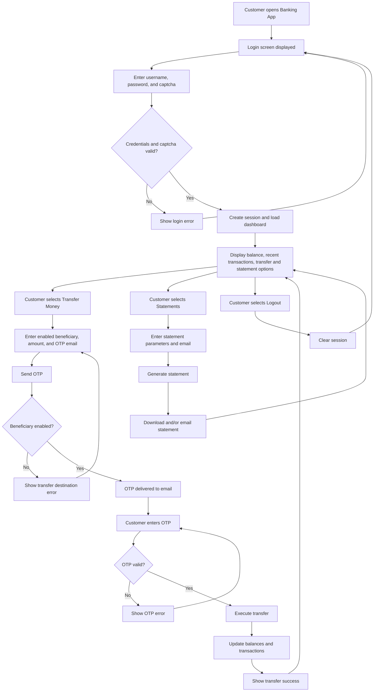

# Banking User Flow Mermaid

```mermaid
flowchart TD
    A["Customer opens Banking App"] --> B["Login screen displayed"]
    B --> C["Enter username, password, and captcha"]
    C --> D{"Credentials and captcha valid?"}

    D -- "No" --> E["Show login error"]
    E --> B

    D -- "Yes" --> F["Create session and load dashboard"]
    F --> G["Display balance, recent transactions, transfer and statement options"]

    G --> H["Customer selects Transfer Money"]
    H --> I["Enter enabled beneficiary, amount, and OTP email"]
    I --> J["Send OTP"]
    J --> K{"Beneficiary enabled?"}

    K -- "No" --> L["Show transfer destination error"]
    L --> I

    K -- "Yes" --> M["OTP delivered to email"]
    M --> N["Customer enters OTP"]
    N --> O{"OTP valid?"}

    O -- "No" --> P["Show OTP error"]
    P --> N

    O -- "Yes" --> Q["Execute transfer"]
    Q --> R["Update balances and transactions"]
    R --> S["Show transfer success"]
    S --> G

    G --> T["Customer selects Statements"]
    T --> U["Enter statement parameters and email"]
    U --> V["Generate statement"]
    V --> W["Download and/or email statement"]
    W --> G

    G --> X["Customer selects Logout"]
    X --> Y["Clear session"]
    Y --> B
```
